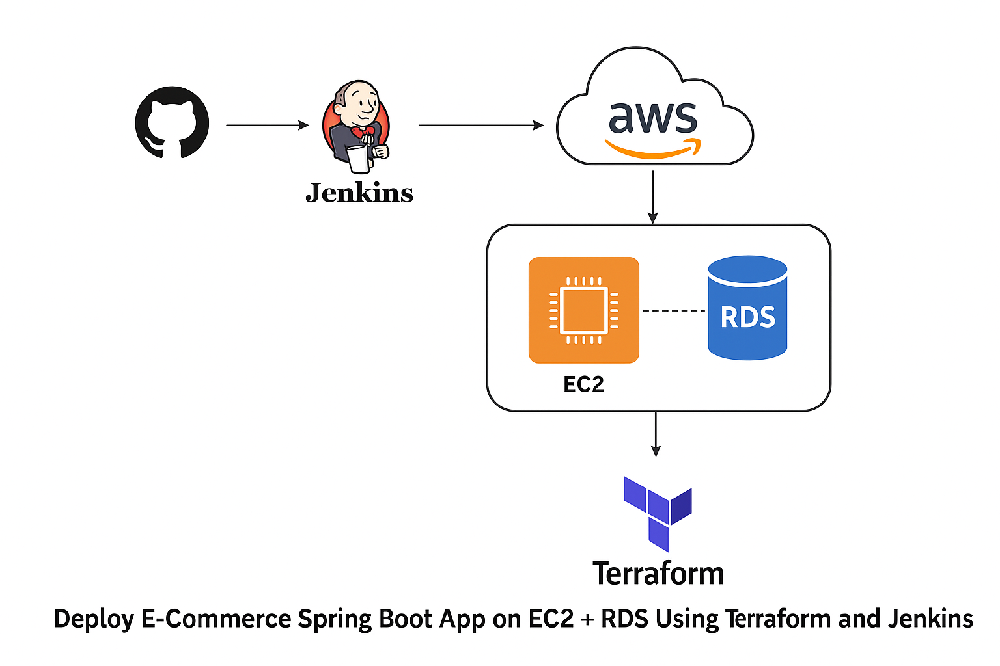
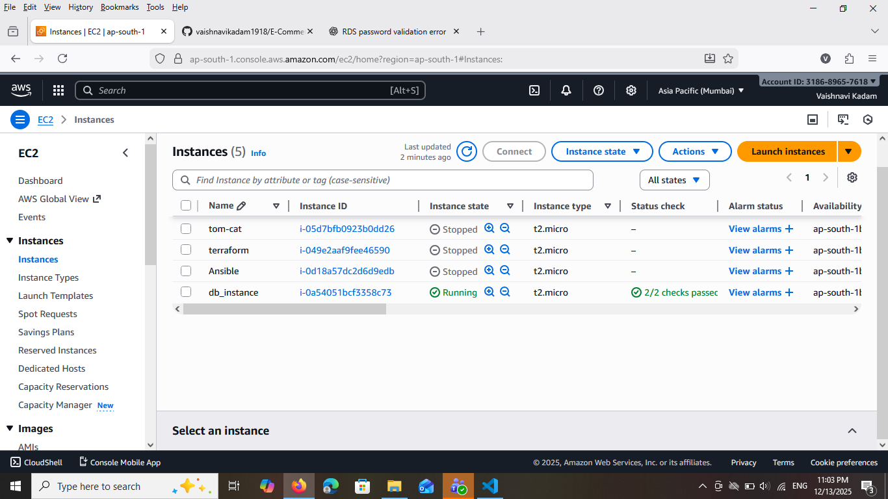
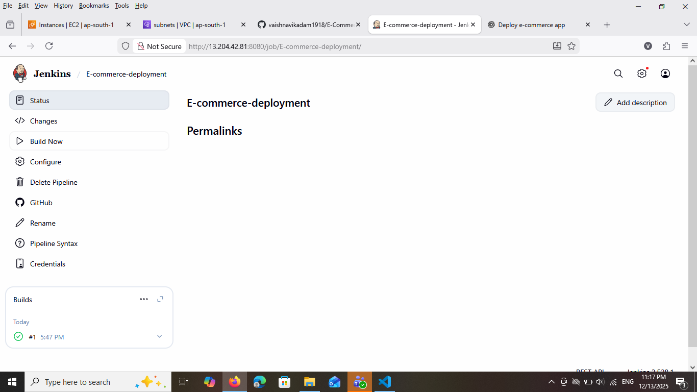

# 🚀 Deploy E-Commerce Spring Boot App on AWS using Terraform & Jenkins

## 📌 Overview
End-to-end DevOps CI/CD project deploying a Spring Boot e-commerce application using Terraform, Jenkins, EC2, and RDS.

---

## 🛠️ Technology Stack
| Category | Tools |
|--------|------|
| Cloud | AWS |
| IaC | Terraform |
| CI/CD | Jenkins |
| App Server | EC2 |
| Database | RDS (MySQL) |
| Build Tool | Maven |
| Language | Java (Spring Boot) |
| OS | Amazon Linux |
| SCM | GitHub |

---


## 🧩 Architecture


## ⚙️ Terraform Apply


## ☁️ AWS EC2


## 📡 Webhooks


## 🔄 Jenkins deployment


## 🌐 Access

http://<EC2_PUBLIC_IP>:8080

## ❗ Troubleshooting

| Issue                 | Solution                    |
| --------------------- | --------------------------- |
| SSH timeout           | Check EC2 SG port 22        |
| App not loading       | Check port 8080 SG          |
| DB connection failed  | Verify RDS SG               |
| Jenkins deploy failed | Check SSH key & permissions |


## ✅ Features
- Terraform IaC
- Jenkins CI/CD
- systemd service
- RDS MySQL backend
- GitHub Webhooks

## ⚙️ Terraform Setup

### Initialize Terraform
```sh
cd terraform
terraform init
terraform plan -var-file=envs/dev.tfvars
terraform apply -var-file=envs/dev.tfvars

## Example Variables
variable "aws_region" { default = "ap-south-1" }
variable "instance_type" { default = "t3.small" }
variable "db_engine" { default = "postgres" }
variable "db_username" {}
variable "db_password" {}

## EC2 User Data Script (Excerpt)
#!/bin/bash
yum update -y
amazon-linux-extras install java-openjdk11 -y
aws s3 cp s3://artifact-bucket/ecommerce-app.jar /opt/app/app.jar

systemctl restart ecommerce
```

## 🔄 Jenkins CI/CD Pipeline
```
Jenkinsfile (Summary)
pipeline {
  agent any
  stages {
    stage('Checkout') { steps { checkout scm } }
    stage('Build') {
      steps {
        dir('app') {
          sh './mvnw clean package -DskipTests'
        }
      }
    }
    stage('Upload to S3') {
      steps {
        sh 'aws s3 cp app/target/*.jar s3://artifact-bucket/app.jar'
      }
    }
    stage('Terraform Apply') {
      steps {
        dir('terraform') {
          sh 'terraform init'
          sh 'terraform apply -auto-approve'
        }
      }
    }
    stage('Deploy to EC2') {
      steps {
        sh 'ssh ec2-user@<EC2-IP> "sudo systemctl restart ecommerce"'
      }
    }
  }
}
```
## 🔐 Secrets & Credentials

Store DB password in AWS SSM Parameter Store (SecureString)

Give EC2 IAM role read access to the parameter

Store AWS keys in Jenkins Credentials Manager

## 🧪 Local Testing
Build locally
cd app
./mvnw clean package
java -jar target/*.jar

💰 Cost Considerations
---
Use t3.micro/t3.small for cost-effective EC2

Use db.t3.micro for RDS (free tier eligible)

Shut down dev EC2 when not in use

⭐ Summary
---
This project provides an end-to-end DevOps pipeline that:

Automates AWS infrastructure provisioning

Deploys a Spring Boot application on EC2

Integrates CI/CD using Jenkins

Uses best practices for secrets, networking, and reliability

## ✍️ Author

**Vaishnavi Kadam**  
DevOps & Cloud Enthusiast  
- 🚀 Specializing in AWS, Terraform, Jenkins & CI/CD  
- 💡 Passionate about automation, cloud deployments, and scalable architectures  
- 🌐 GitHub: https://github.com/vaishnavikadam1918 
- 📧 Email: vaishnavikadam8153@gmail.com

